# Modeling and Analysis of Spiking Patterns in LIF Neurons under Deterministic and Stochastic Current Inputs

---

## Abstract

Understanding the dynamics of neuronal spiking under different input currents is fundamental for computational neuroscience and neuromorphic engineering. This study investigates how single-compartment Leaky Integrate-and-Fire (LIF) neurons respond to various current inputs, including constant, linear ramp, floor, random, and sinusoidal currents. Both noisy and noiseless conditions are examined. Key metrics analyzed include spike timing, membrane potential trajectories, and instantaneous firing frequencies. Results demonstrate how neuron parameters such as membrane resistance, time constant, resting potential, and spiking threshold influence spiking patterns, highlighting the impact of input variability and intrinsic neuronal properties on firing behavior.

---

## Introduction

The Leaky Integrate-and-Fire (LIF) model is a widely used abstraction for studying neuron dynamics. It captures essential features of neuronal spiking while remaining computationally efficient. In this study, we systematically explore how LIF neurons respond to diverse input currents. The objectives include:

- Characterizing spike patterns under constant, linear, floor, random, and sinusoidal currents.
- Investigating the effects of noisy versus noiseless inputs.
- Assessing the influence of intrinsic parameters (R, tau, u_rest, threshold) on spike timing and frequency.

These insights are crucial for understanding fundamental neuronal processing mechanisms and for designing neuromorphic circuits.

---

## Methods

### LIF Neuron Model

The LIF neuron integrates incoming current with a leak term and emits a spike once the membrane potential crosses a threshold. After a spike, the neuron resets to its resting potential.

**Parameters Studied:**

- Membrane resistance (R)
- Membrane time constant (tau)
- Resting potential (u_rest)
- Spiking threshold (threshold)

### Input Current Protocols

1. **Constant Current:** Step currents of fixed amplitude.
2. **Linear Ramp Current:** Linearly increasing current over time.
3. **Floor Current:** Current rounded to the nearest discrete level.
4. **Random Current:** Stochastic input with variable amplitude.
5. **Sinusoidal Current:** Oscillatory input representing periodic modulation.

Each protocol was tested under **noisy** and **noiseless** conditions to examine robustness to input variability.

### Analysis Metrics

- **Spike Raster Plot:** Spike occurrences over time.
- **Membrane Potential (PSP) Trace:** Time evolution of membrane potential.
- **Spike Frequency:** Instantaneous firing rate calculated between consecutive spikes.

---

## Results

### 1. Constant Current

Constant currents induced regular spiking patterns depending on neuron parameters. Decreasing tau or increasing resistance increased firing frequency.

### 🔹 Constant current waveform. 
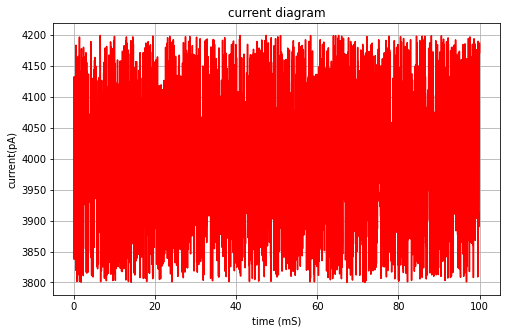

### 🔹 Spike raster for constant current.  
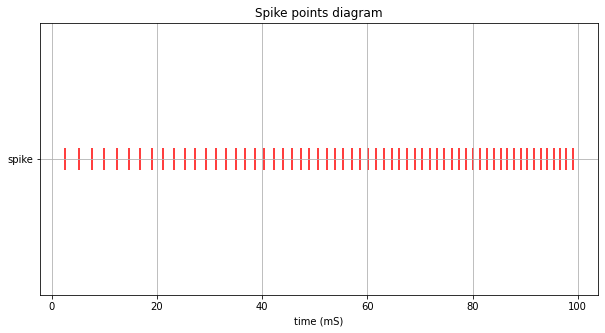

### 🔹 Membrane potential trajectory (PSP).  
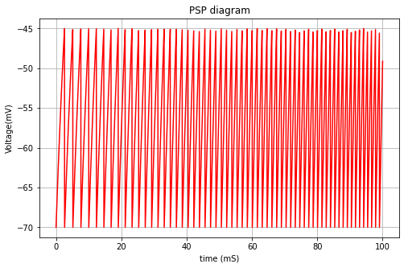

### 🔹 Instantaneous spike frequency.  
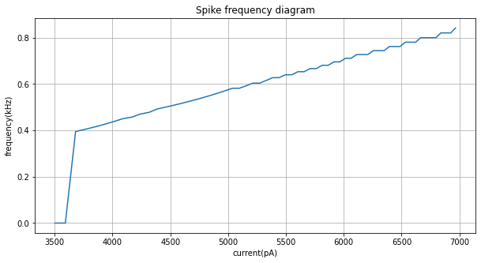

---

### 2. Linear Ramp Current

Linear currents generated progressively higher spiking rates. Noisy linear currents introduced variability in spike timing.

### 🔹 Linear ramp current waveform.  
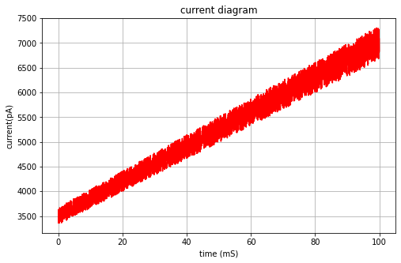

### 🔹 Spike raster for linear ramp.  
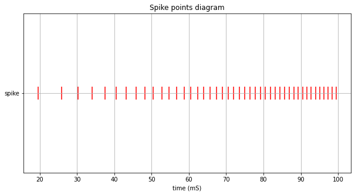

### 🔹 PSP trajectories under linear ramp.  
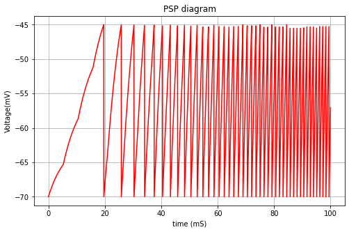

### 🔹 Spike frequency diagram.  
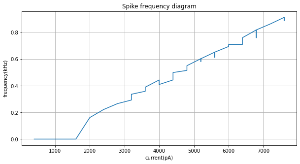

---

### 3. Floor Current

Floor currents showed stepwise spike rate increases with each discrete current jump. Noise slightly desynchronized spiking events.

### 🔹 Floor current waveform.  
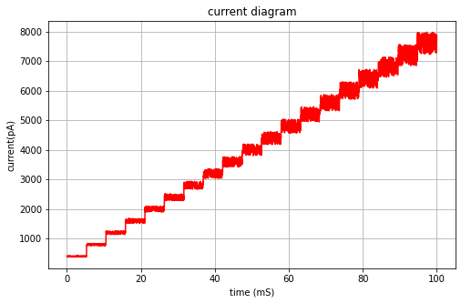

### 🔹 Spike raster diagram.  

---

### 4. Random Current

Random currents generated irregular spiking, demonstrating sensitivity of LIF neurons to stochastic inputs.

### 🔹 Random current waveform.  
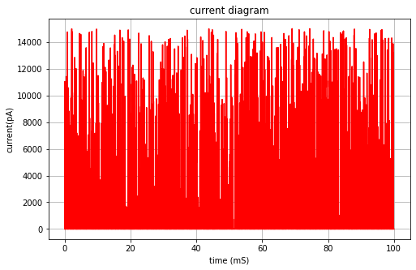

### 🔹 Spike raster for random input.  
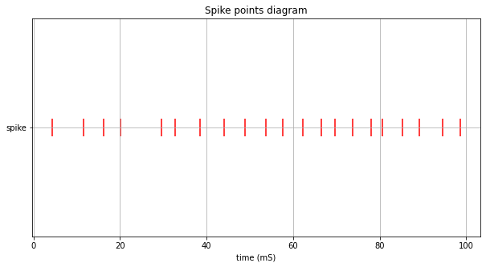

---

### 5. Sinusoidal Current

Sinusoidal currents produced periodic spiking that aligned with current peaks. Noise slightly altered spike timing and frequency modulation.

### 🔹 Sinusoidal current waveform.  
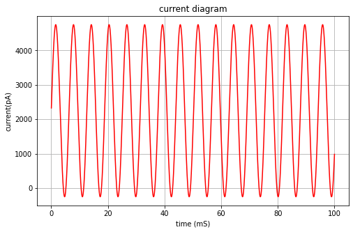

### 🔹 Spike raster diagram.  
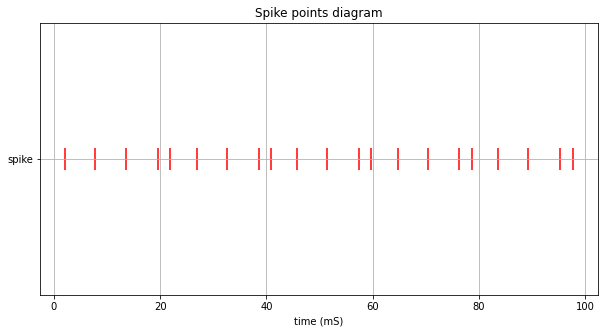

### 🔹 PSP trace for sinusoidal input.  
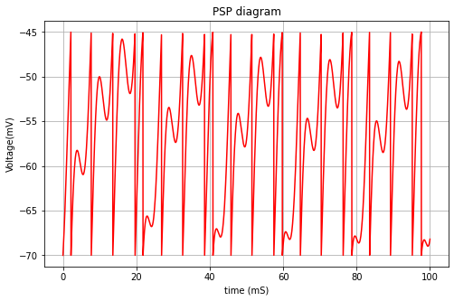

---

## Discussion

1. **Neuron Parameters:** Higher resistance and longer tau resulted in slower membrane potential decay, increasing spiking regularity.
2. **Input Type:** Step, ramp, and sinusoidal currents produced predictable spike patterns, while random currents introduced irregularity.
3. **Noise Effects:** Noisy currents increased spike timing variability, especially in low-threshold neurons.
4. **Model Validity:** LIF neurons capture essential features of spiking behavior, providing insight into firing dynamics under different stimuli.

---

## Conclusion

LIF neurons demonstrate distinct spiking behaviors under varying input currents and intrinsic parameters. Constant, linear, floor, and sinusoidal currents produced structured spike patterns, while random and noisy inputs induced irregular firing. Parameter tuning enables control over firing rates and spike timing, supporting applications in computational modeling and neuromorphic engineering.

---

## Future Directions

- Extend to multi-compartment neuron models for dendritic integration studies.
- Investigate population-level dynamics using networks of LIF neurons.
- Apply adaptive thresholds to explore spike-timing-dependent plasticity.
- Examine interaction between synaptic input variability and intrinsic parameters.

---

## References

1. Gerstner, W., & Kistler, W. M. (2002). *Spiking Neuron Models: Single Neurons, Populations, Plasticity*. Cambridge University Press.  
2. Izhikevich, E. M. (2007). *Dynamical Systems in Neuroscience: The Geometry of Excitability and Bursting*. MIT Press.  
3. Burkitt, A. N. (2006). *A review of the integrate-and-fire neuron model: I. Homogeneous synaptic input*. Biological Cybernetics, 95(1), 1–19.  
4. Dayan, P., & Abbott, L. F. (2001). *Theoretical Neuroscience: Computational and Mathematical Modeling of Neural Systems*. MIT Press.  
5. Brunel, N., & Wang, X.-J. (2001). *Effects of neuromodulation on spike-timing and frequency response of cortical neurons*. Journal of Neurophysiology, 86, 104–115.
